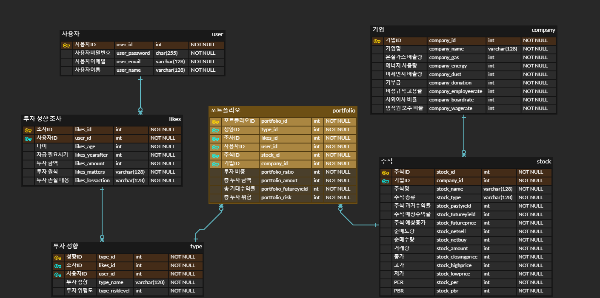
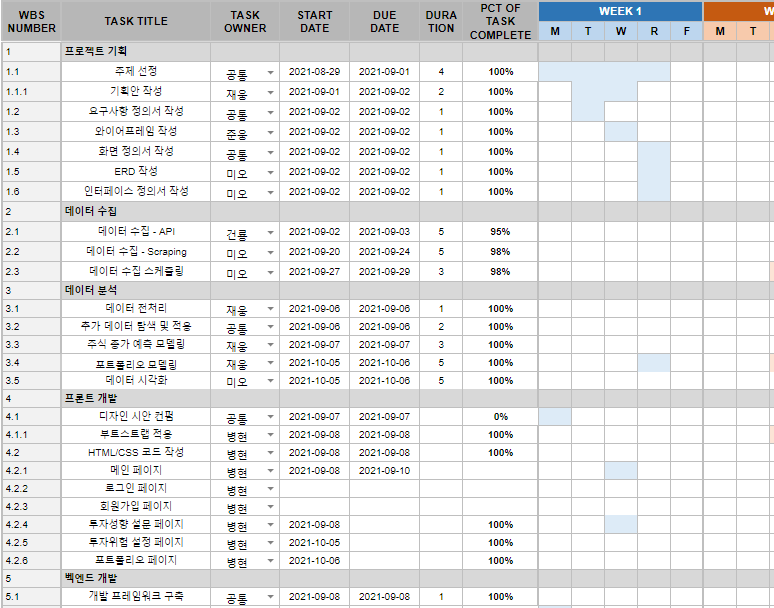
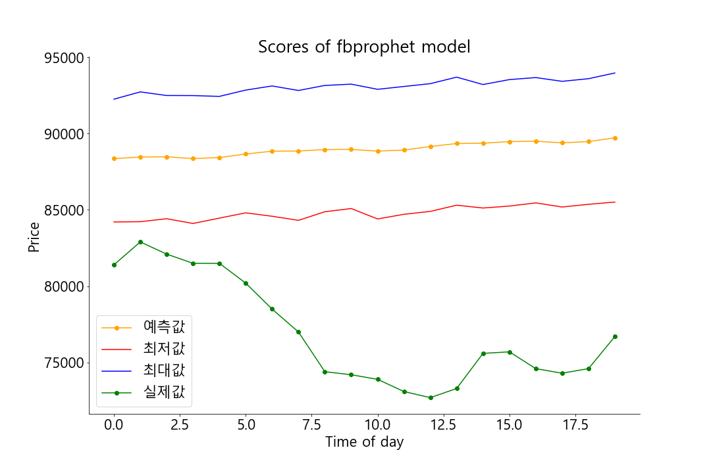
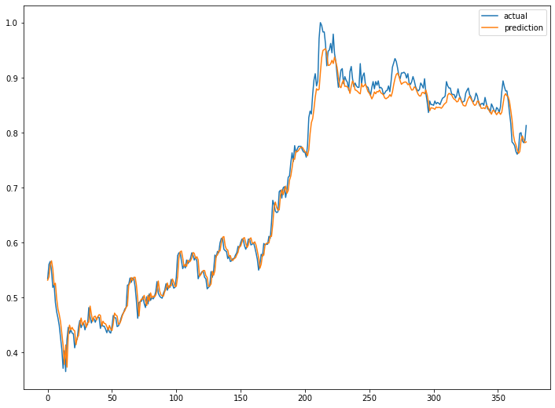
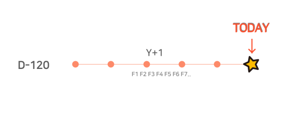
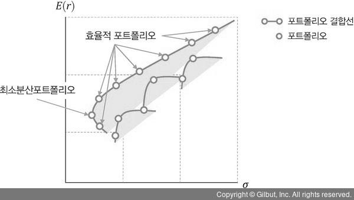
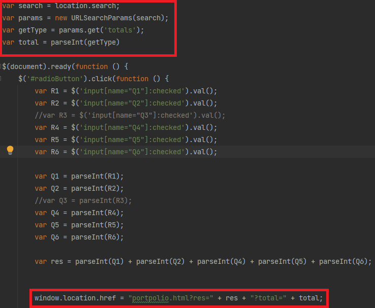

# ChickenStock :chicken:

### :chart_with_upwards_trend: 주식 종가 예측 및 포트폴리오 추천 :star:

> 멀티캠퍼스  '빅데이터 기반 지능형 서비스 개발'  과정에서 진행한 파이널 프로젝트입니다.
>
> 참여 :  [jaywoong](https://github.com/jaywoong),  [mmeooo](https://github.com/mmeooo),  [00FFEF](https://github.com/00FFEF),  [top430](https://github.com/top430),  [yoojunwoong](https://github.com/yoojunwoong)

	

#### **:bulb: 최종 구현**

**[YouTube시연](https://youtu.be/m00NjTMoaJs)** &nbsp;&nbsp; **[결과 보고서](md-images/chickenstock.pdf)**

####  **Table of Contents**

**:mag:[Overview](#idx1)** **:shamrock:[Process](#idx2)** **:book: [Skills](#idx2)** **:dancers: [Team](#idx3)** **:clock2: [Scheduling](#idx4)**

___

## :mag: Overview 

- #### **주제**

주식 종가 예측 모델링에 그치지 않고, 포트폴리오 모델을  활용하여 투자자의 투자 성향에 따른 주식 포트폴리오를 추천해주는 서비스 

- #### **필요성** 

투자자의 성향을 고려하지 않고 개별 종목과 포트폴리오를 추천해 줄 경우  손실을 인내하기 쉽지 않다.  따라서 개별주의 종가를 예측하고,  예상 가격, 변동성, 리스크 등을 고려하여 투자자에게 최적화된 포트폴리오를 구성하는 모델을 구축하고자 한다. 가격예측 모델과 포트폴리오 모델을 활용하여,  고객의 투자 성향 및 위험 감내 수준에 따른 주식 포트폴리오 추천 서비스를 제공하려 한다.

- #### **데이터**

https://kr.investing.com/indices/nasdaq-composite-historical-data

http://data.krx.co.kr/contents/MDC/MAIN/main/index.cmd

- #### 주요 기능

1. **사용자 투자 성향 조사 :eyes:**
2. **주식 종가 예측 :seedling:**
3. **주식 포트폴리오 추천 :gift:**
4. **추천 기업 최근 일주일 뉴스기사 제공 :newspaper:** 

 

##  :shamrock: Process 

- #### MVT pattern

  

- #### ERD

  

* #### 요구사항 정의서

  

* #### 화면 정의서

  |  |  |
  | ------------------------------------------------------------ | ------------------------------------------------------------ |

 

 ## :book: Skills 

- #### 기술 스택

  

- #### 디렉토리 구조

  * **Frontend  -  [보러가기](stock/README.md) :heavy_check_mark:**
  * **Backend**
    * **Machine Learning  -  [보러가기](modeling/README.md) :heavy_check_mark:**
    * **Scraping  -  [보러가기](scraping/README.md) :heavy_check_mark:**
  
   

## :dancers: Team 

 

## :clock2: Scheduling 

* #### WBS

<<<<<<< HEAD

## 주가 예측 모델 

#### 예측 모델 비교

ARIMA, fbprophet, LSTM 세 가지 모델을 통해 주가를 예측하고 비교한 결과 LSTM이 주가 예측에서 가장 뛰어난 성능을 보였습니다.

#### LSTM을 활용한 주가 예측 모델 개발

과거 120일 간의 데이터를 통해 내일의 주가를 예측하는 모델을 구성하였습니다.

10 거래일 이후의 종가를 예측하기 위해 두가지 방법으로 LSTM모델을 응용하였습니다.

단순히 120일 이후의 가격을 예측하는 방법과, 미래의 Feature값을 fbprophet을 통해 예측하고 예측한 값을 다시 LSTM 모델에 학습시키는 과정을 반복해 10 일 뒤 종가를 예측하는 방법을 비교한 결과, LSTM+fbprophet모델이 우수한 성능을 보였으며, 모델 성능의 발전 가능성이 높은 것으로 사료되어  LSTM+fbprophet모델을 채택하였습니다.

## 포트폴리오 추천 모델

#### MVP(Minimum Volatility Portfolio, 최소 분산 포트폴리오)

Sharpe Ratio를 통해 포트폴리오의 투자 위험 대비 수익률을 측정하고, 최소분산포트폴리오를 활용하여 위험은 최소화하면서 초과수익을 얻을 수 있는 포트폴리오를 구성하였습니다.

#### 포트폴리오 추천 모델 구축

최적화 알고리즘 SLSQP(Sequential Least SQuares Programming)를 이용함으로써 최소분산포트폴리오의 투자 비중을 찾아냈습니다. 

=======
* #### LSTM

* #### SLSQP

* #### WEB(parameter 전송)

  

html에서 다음 html로 넘어갈 때 파라미터를 전송하는 코드
>>>>>>> e44b87b7ca785f289d6fb25d15a9e64d15951fde

