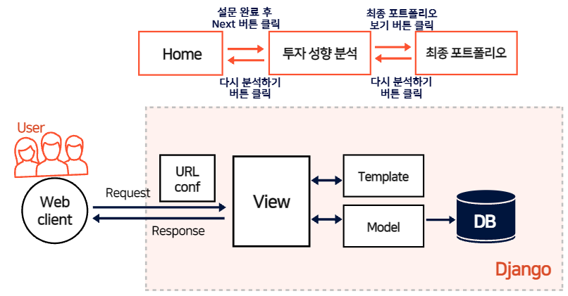
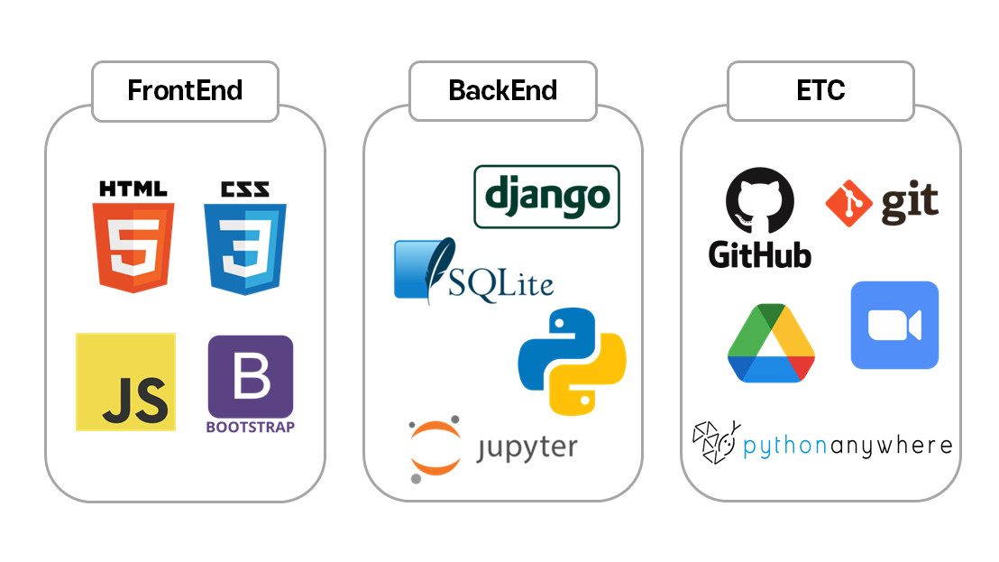
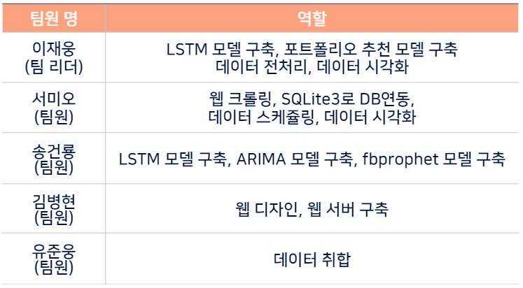
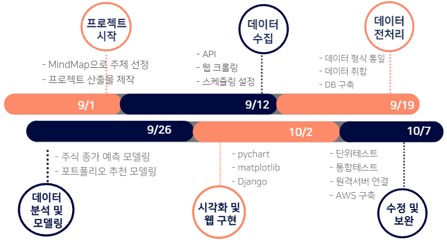
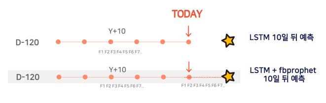
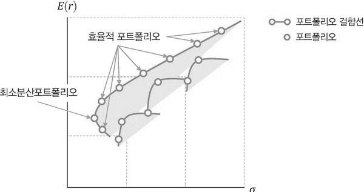

# ChickenStock :chicken:

### :chart_with_upwards_trend: 주식 종가 예측 및 포트폴리오 추천 :star:

> 멀티캠퍼스  '빅데이터 기반 지능형 서비스 개발'  과정에서 진행한 파이널 프로젝트입니다
>
> 참여 :  [jaywoong](https://github.com/jaywoong),  [mmeooo](https://github.com/mmeooo),  [00FFEF](https://github.com/00FFEF),  [top430](https://github.com/top430),  [yoojunwoong](https://github.com/yoojunwoong)
>
> 기간 : 2021.09.06 ~ 2021.10.08

	

#### **:bulb: 최종 구현**

**[YouTube시연](https://youtu.be/m00NjTMoaJs)** &nbsp;&nbsp; **[결과보고서](md-images/chickenstock.pdf)**


####  :pushpin: **Table of Contents**

> **:mag: [Overview](#idx1)** 
>
> **:shamrock:  [Process](#idx2)**  
>
> **:hammer:  [Modeling](#idx3)**
>
>  **:alarm_clock: [Data Scheduling](#idx4)**

___


## :mag: Overview <a id="idx1"></a>

#### :one: 주제

주식 종가 예측 모델링에 그치지 않고, 포트폴리오 모델을  활용하여 투자자의 투자 성향에 따른 주식 포트폴리오를 추천해주는 서비스 

#### :two: 필요성 

투자자의 성향을 고려하지 않고 개별 종목과 포트폴리오를 추천해 줄 경우  손실을 인내하기 쉽지 않다.  따라서 개별주의 종가를 예측하고,  예상 가격, 변동성, 리스크 등을 고려하여 투자자에게 최적화된 포트폴리오를 구성하는 모델을 구축하고자 한다. 가격예측 모델과 포트폴리오 모델을 활용하여,  고객의 투자 성향 및 위험 감내 수준에 따른 주식 포트폴리오 추천 서비스를 제공하려 한다.

#### :three: 데이터

* **공통 거시 경제 지표**
  * NASDAQ, S&P 500, CBOE VIX, 원 달러 환율, 2년만기 미국채 선물, 10년만기 미국채 선물 
  * https://kr.investing.com/indices/nasdaq-composite-historical-data
* **개별주 관련 지표**
  * 거래량, PER, PBR, ATR, 투자자별 거래실적
  * http://data.krx.co.kr/contents/MDC/MAIN/main/index.cmd

#### :four: 주요 기능

* **사용자 투자 성향 조사 :eyes:** 

* **주식 종가 예측 :seedling:**  
* **주식 포트폴리오 추천 :gift:** 
* **추천 기업 최근 일주일 뉴스기사 제공 :newspaper:** 

<br>

##  :shamrock: Process <a id= 'idx2'></a>

- #### MVT pattern

  

- #### ERD -  :link: [ERDcloud](https://www.erdcloud.com/p/mq6ZdjhBwyH6Bsomj) 

  

- #### 프로젝트 산출물
   * **WBS with Gantt Chart- [보러가기](https://docs.google.com/spreadsheets/d/1p-GPu5G6td5hkA7z9YXG2BhNy6Scw2k5/edit?usp=sharing&ouid=101019567947057551589&rtpof=true&sd=true) :heavy_check_mark:**
   * **와이어프레임 - [보러가기](md-images/wireframe.png) :heavy_check_mark:**
   * **요구사항 정의서 - [보러가기](https://docs.google.com/spreadsheets/d/1GvaA6mY9RHKyGHXjK7JKzFMXS99q8S-w2CC5LUHPJYQ/edit?usp=sharing) :heavy_check_mark:**
   * **화면 정의서 - [보러가기](https://docs.google.com/presentation/d/1JZxg_nooMLJrf_V7qvjJE8uLgT7kMctWmcBUyPsRvMU/edit?usp=sharing) :heavy_check_mark:**

- #### Tech Stack

  

- ####  Team  Role



* #### Project Plan <a id="idx5"></a>



<br>

## :hammer: Modeling <a id="idx3"></a>

#### :one: 주가 예측 모델

* #### 주가 예측 모델 비교


ARIMA, fbprophet, LSTM 세 가지 모델을 통해 주가를 예측하고 비교한 결과 LSTM이 주가 예측에서 가장 뛰어난 성능을 보였습니다.


* #### LSTM을 활용한 주가 예측 모델 개발

과거 120일 간의 데이터를 통해 내일의 주가를 예측하는 모델을 구성하였습니다.



10 거래일 이후의 종가를 예측하기 위해 두가지 방법으로 LSTM모델을 응용하였습니다.


단순히 120일 이후의 가격을 예측하는 방법과, 미래의 Feature값을 fbprophet을 통해 예측하고 예측한 값을 다시 LSTM 모델에 학습시키는 과정을 반복해 10 일 뒤 종가를 예측하는 방법을 비교한 결과, LSTM+fbprophet모델이 우수한 성능을 보였으며, 모델 성능의 발전 가능성이 높은 것으로 사료되어  LSTM+fbprophet모델을 채택하였습니다.


#### :two: 포트폴리오 추천 모델

* #### MVP(Minimum Volatility Portfolio, 최소 분산 포트폴리오)

Sharpe Ratio를 통해 포트폴리오의 투자 위험 대비 수익률을 측정하고, 최소분산포트폴리오를 활용하여 위험은 최소화하면서 초과수익을 얻을 수 있는 포트폴리오를 구성하였습니다.



* #### 포트폴리오 추천 모델 구축

최적화 알고리즘 SLSQP(Sequential Least SQuares Programming)를 이용함으로써 최소분산포트폴리오의 투자 비중을 찾아냈습니다. 


<br>

##    :alarm_clock: Data Scheduling<a id="idx4"></a>

#### :one: 데이터 수집

- 데이터 수집 대상

  `삼성전자, SK하이닉스, LG화학, LG전자, LG이노텍, 삼성에스디에스, 삼성전기, 삼성생명, 삼성화재, SK텔레콤, KT, 현대건설, 삼성엔지니어링, 대한항공, 현대차, 기아, 오리온, CJ제일제당, 오뚜기, 미래에셋대우, 한국금융지주, NH투자증권, LG생활건강, 아모레퍼시픽, 아모레G, 강원랜드, 호텔신라, KB금융, 신한지주, 하나금융지주, 롯데쇼핑, 이마트, 신세계, GS리테일, NAVER, 카카오, CJENM, 스튜디오드래곤, 삼성바이오로직스, 셀트리온, 한미약품, 엔씨소프트, 넷마블, 한화솔루션, LS, POSCO,고려아연, S-Oil, SK이노베이션, HMM`

- 데이터 출처 및 수집 방법

  - 공통 거시 경제 지표 중 `S&P, CBOE` 는 `DataFinanceReader` 모듈을 통해 수집하고, `NASDAQ, futures2y, futures10y` 은 [인베스팅닷컴](https://kr.investing.com/indices/nasdaq-composite-historical-data)  스크래핑을 통해 수집했습니다.

  - 개별주 관련 지표인 `거래량, atr, PER, PBR, 기관합계, 기타법인, 개인, 외국인합계` 는 [KRX](http://data.krx.co.kr/contents/MDC/MAIN/main/index.cmd) 데이터를 제공하는 `pykrx` 모듈을 통해 수집했습니다. 

  - [빅카인즈](https://www.bigkinds.or.kr/) 에서 기업별 최근 일주일 뉴스기사를 스크래핑하여 수집해 웹에서 제공했습니다.

  ```python
  # scraping/bigkinds_db_schedule.py
  
  from selenium import webdriver
  from bs4 import BeautifulSoup
  class Bigkinds:
      def __init__(self):
          self.driver = webdriver.Chrome('C:\chromedriver.exe')
      def crawling(self, url, stockname):
       	while curPage <= self.totalPage:
              soup = BeautifulSoup(self.driver.page_source, 'html.parser')
              articles = soup.select('div.news-inner')
              print('Current Page : {}'.format(curPage))
              for article in articles:
                  title = article.select_one('span.title-elipsis').text.strip()
                  press = article.select_one('div.info > div > a.provider').text.strip()
                  category = article.select_one('div.info > div > span.bullet-keyword').text.strip()
                   date = article.select_one('div.info > p.name').text.strip()
                   self.contents.append([title, press, category, date])
   
  ```
  
  

#### :two: SQLite3 연동

* 수집한 데이터를 DataFrame으로 합쳐 sqlite3에 저장하였습니다.

```python
# modeling/stock_db_schedule.py

import sqlite3
class UpdateDB:
    def __init__(self):
        self.conn = sqlite3.connect('../modeling/stock.db')
        self.c = self.conn.cursor()  
        
   def saving(self):  
        self.df_merge = pd.merge(self.df_krx, self.df_invest, on='date')
        self.df_merge.to_sql('{}'.format(self.stockname), self.conn, 	if_exists='append')  
        self.conn.commit()
        
```

* 저장된 sqlite3를 웹에서 호출하였습니다.

```python
# stock/views.py

def news(request):
	result = dict()
	db_news = sqlite3.connect('bigkinds.db')
	db_news.row_factory = sqlite3.Row
	c = db_news.cursor()
	c.execute("select title, press, category, date, text from {}_news".format('CJENM'))
    data = c.fetchall()
    result['erows'] = data
    
    return render(request, 'news.html', result)

```
