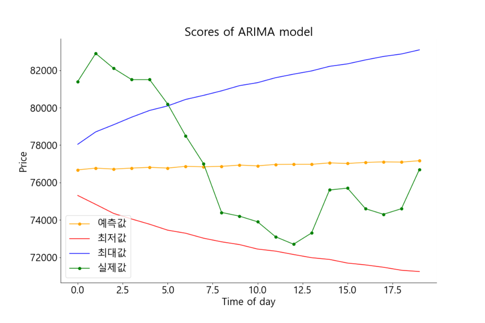
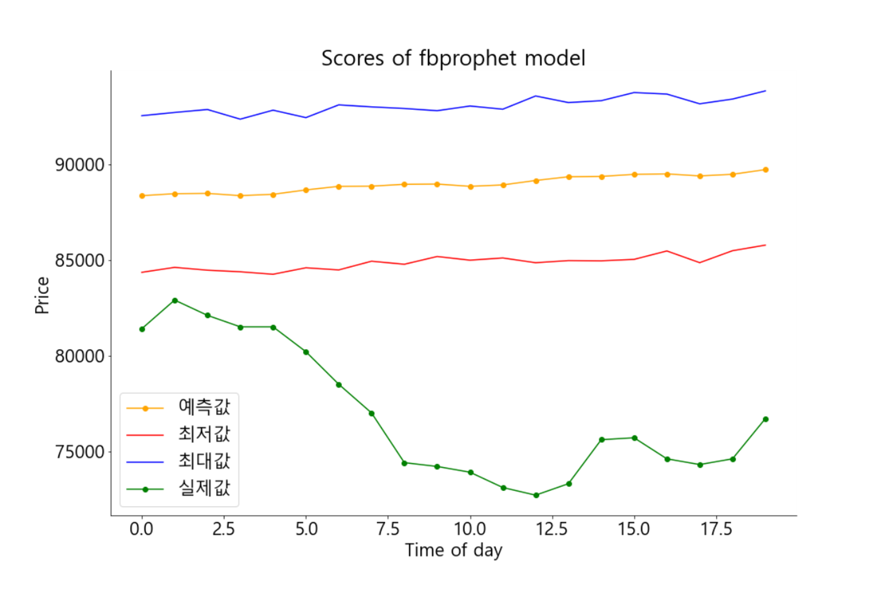
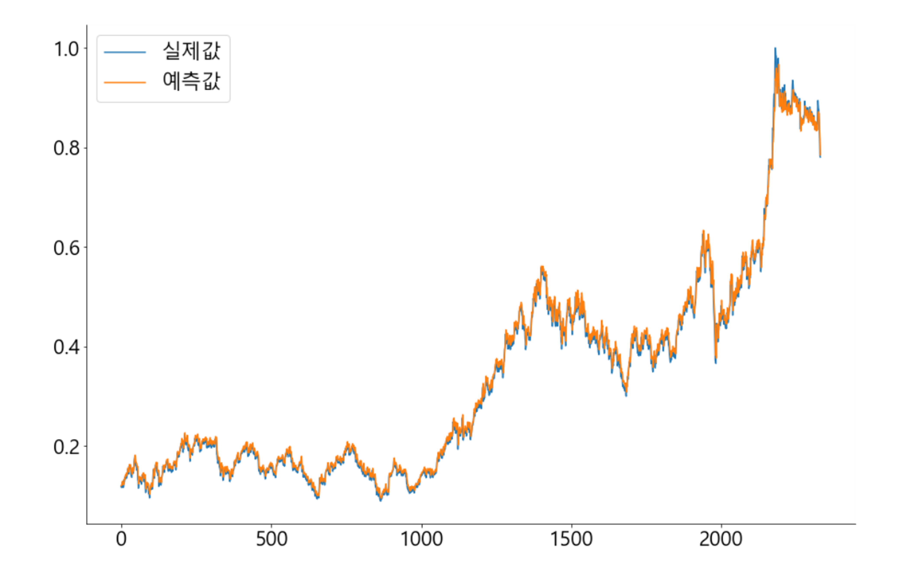
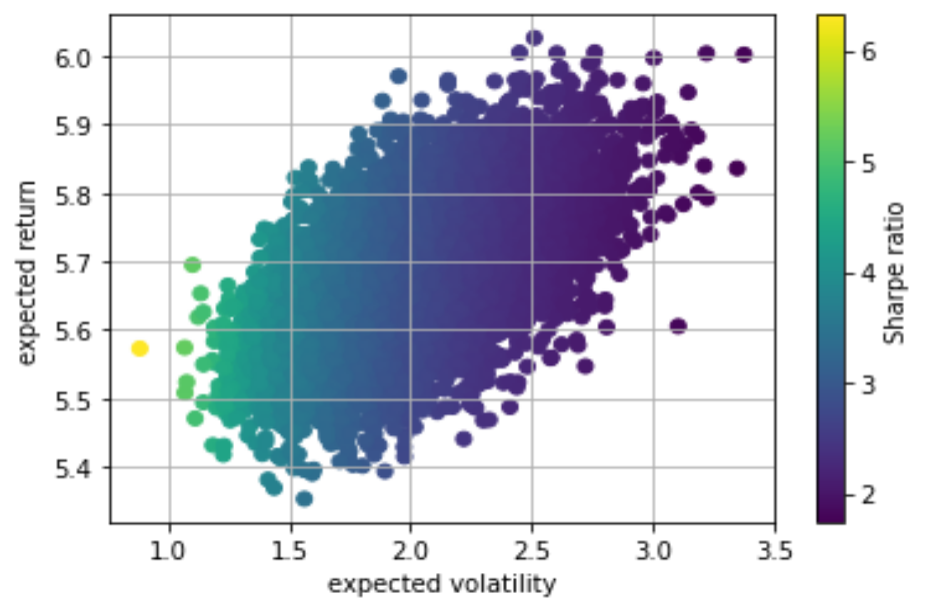

### 디렉토리 구조

```
📦modeling
 ┣ 📂data
 ┃ ┣ 📜10년만기 미국채 선물 역사적 데이터.csv
 ┃ ┣ 📜2년만기 미국채 선물 역사적 데이터.csv
 ┃ ┣ 📜ARIMA.png
 ┃ ┣ 📜CBOEVolatilityIndex내역.csv
 ┃ ┣ 📜fbprophet.png
 ┃ ┣ 📜LSTM2.png
 ┃ ┣ 📜merge_data.csv
 ┃ ┣ 📜merge_data.xlsx
 ┃ ┣ 📜merge_data_test.csv
 ┃ ┣ 📜PERPBR.xlsx
 ┃ ┣ 📜S&P500내역.csv
 ┃ ┣ 📜samsung.xlsx
 ┃ ┣ 📜samsung_test.xlsx
 ┃ ┣ 📜stock.xlsx
 ┃ ┣ 📜USD_KRW내역.csv
 ┃ ┣ 📜거래실적.xlsx
 ┃ ┣ 📜나스닥종합지수 내역.csv
 ┃ ┗ 📜시세추이.xlsx
 ┣ 📂notebook
 ┃ ┣ 📜amore_G_preprocessing.ipynb
 ┃ ┣ 📜amore_preprocessing.ipynb
 ┃ ┣ 📜ARIMA.ipynb
 ┃ ┣ 📜deeplearn.ipynb
 ┃ ┣ 📜fbprophet.ipynb
 ┃ ┣ 📜kakao_preprocessing.ipynb
 ┃ ┣ 📜lstm_samsung.ipynb
 ┃ ┣ 📜lstm_samsung10.ipynb
 ┃ ┣ 📜naver_preprocessing.ipynb
 ┃ ┣ 📜optimize_pf.ipynb
 ┃ ┣ 📜pred_machine.ipynb
 ┃ ┣ 📜preprocessing.ipynb
 ┃ ┣ 📜samsung2_preprocessing.ipynb
 ┃ ┗ 📜samsung_preprocessing.ipynb
 ┣ 📜db_operator.py
 ┣ 📜execute.py
 ┣ 📜portfolio_model.py
 ┣ 📜pred_machine.py
 ┣ 📜preprocessing.py
 ┣ 📜stock.db
 ┣ 📜stock_db_existing.py
 ┣ 📜stock_db_schedule.py
 ┗ 📜Stock_List.csv
```

------

### 결과 시각화

* #### ARIMA

  

* #### fbprophet

  

* #### LSTM

  

* #### MVP


